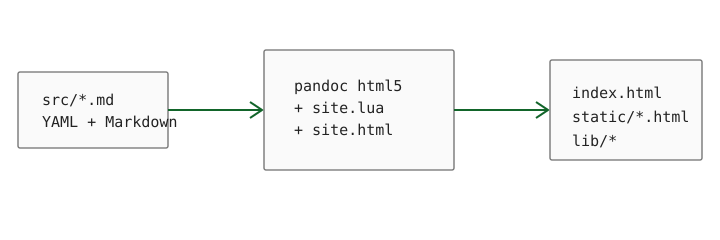

## 基本文本

普通段落保持接近 GNU 手册的阅读密度，同时用接近 Vim 文档站点的克制绿色作为强调色。这里包含 *斜体*、**粗体**、~~删除线~~、`make all`、CO~2~ 与 x^2^。链接既可以指向 [Pandoc](https://pandoc.org/)，也可以指向本页的[数学公式](#数学公式)。

行内公式示例为 $\sigma^2 = \operatorname{Var}(X)$，它不会请求任何 CDN。

> 静态站点的关键不是“没有 JavaScript”，而是正文和路由不依赖 JavaScript。这里的 JavaScript 只负责渐进增强：标签筛选和数学渲染。

## 清单与定义

- 构建输入
  - `src/*.md`
  - `site.html`
  - `site.lua`
- 构建输出
  - `index.html`
  - `static/*.html`
  - `static/media/*`

1. Pandoc 负责 AST 与 HTML5；
2. Lua filter 负责站点语义；
3. pit.js + lit-html 负责少量交互。

- [x] 不调用 `store()`
- [x] 不创建 WebSocket
- [x] 所有依赖位于 `lib/`

### 三级标题 {#三级标题}

三级标题用于验证目录层级与自动锚点。

::: {.note}
这是 Pandoc fenced Div；模板把 `.note` 渲染成非常克制的说明框。
:::

元信息
: YAML front matter 中的 `title`、`date`、`tags` 与 `summary`。

渐进增强
: 即使模块脚本加载失败，文章、链接、目录和标签列表仍然是可读的静态 HTML。

## 数学公式

行间公式使用标准 Pandoc Markdown 语法：

$$
P(A\mid B)=\frac{P(B\mid A)P(A)}{P(B)}.
$$

再给出一个带求和与极限的式子：

$$
\bar{x}=\frac{1}{n}\sum_{i=1}^{n}x_i,
\qquad
\lim_{n\to\infty}\left(1+\frac{1}{n}\right)^n=e.
$$

## 代码高亮

```makefile
SRC := $(wildcard src/*.md)
PAGES := $(patsubst src/%.md,static/%.html,$(SRC))

all: index.html $(PAGES)
```

```javascript
import { signal, effect } from './lib/pit.js';

const tag = signal('all');
effect(() => console.log('active tag:', tag.get()));
```

## 表格

| 层次 | 职责 | 是否需要运行时服务 |
|---|---|:---:|
| Markdown | 内容与元信息 | 否 |
| Pandoc + Lua | 构建 HTML | 否 |
| arui 前端 | 标签筛选 | 否 |
| KaTeX | 浏览器内公式排版 | 否 |

: 静态生成链路

## 图片与脚注



脚注适合放补充说明，而不打断正文阅读。[^make]

[^make]: `make` 默认目标会一次生成首页、文章页和静态媒体目录。

---

<details>
<summary>可折叠的原生 HTML 区块</summary>

这类元素不需要额外组件库；保持原生即可。

</details>
